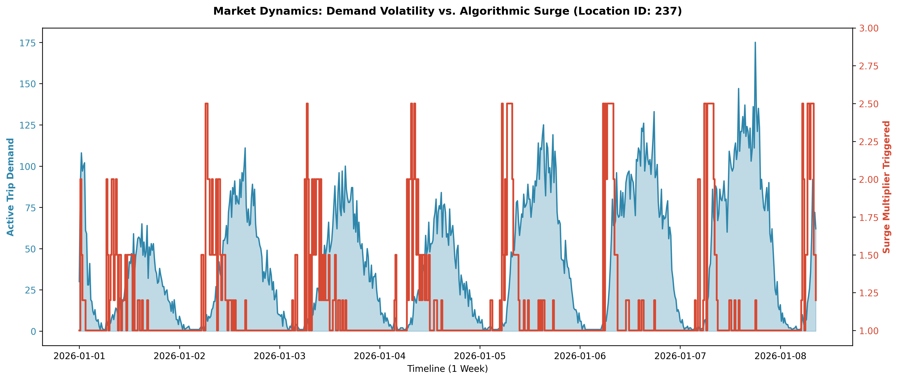

# 🚕 Dynamic Surge Pricing & Marketplace Optimization Engine

**Author:** Ashil Mascarenhas | Data & Product Analytics  
**Tech Stack:** Python, DuckDB, Pandas, Scikit-Learn, Matplotlib  
**Dataset:** 30M+ rows of NYC TLC Parquet Data (Q1 2026)

## 📌 Executive Summary
Flat-fare pricing in ride-hailing marketplaces leads to severe supply-demand imbalances during peak hours. This project engineers a dynamic surge pricing algorithm from scratch using 30M+ transactional records. 

By modeling real-time demand spikes and applying a capped surge multiplier, the simulation yielded an **$8.3M (+5.51%) lift in Gross Merchandise Value (GMV)** over a 2-month period, while strategically managing a 6.74% elasticity-driven trip loss to preserve long-term Customer Lifetime Value (LTV).

## 🧠 The Architecture & Logic
To handle tens of millions of rows locally without crashing, I bypassed traditional Pandas workflows in favor of **DuckDB**, processing highly compressed `.parquet` files entirely in-memory.

### 1. Time-Series Aggregation (The Demand Spike Ratio)
I wrote complex SQL Common Table Expressions (CTEs) and Window Functions to segment the city into geographic zones and time-bucket trips into 15-minute intervals. 
* Calculated a rolling 2-hour baseline demand for every specific zone.
* Engineered a `demand_spike_ratio` to detect real-time market volatility.

### 2. The Algorithmic Surge Thresholds
A pure mathematical model lets prices surge infinitely. A product-focused model caps the surge to prevent user churn. 
* Base Fare: Spike Ratio < 1.2x
* Moderate Surge (1.2x - 1.5x): Spike Ratio 1.2x - 2.0x
* **Hard Cap (2.5x):** Spike Ratio > 3.0x (Protects platform trust and retention).

## 📊 Visualizing the Market Dynamics
*The blue area represents the raw demand volatility in the busiest zone. The red line represents the algorithm stepping up to suppress demand and extract revenue during peak spikes.*

*(Note to Ashil: Ensure `surge_timeline.png` is in your `images` folder)*

## 💰 The Revenue Simulation (Price Elasticity)
I stress-tested the algorithm against historical data using a **Price Elasticity Coefficient of -0.4**. This ensures that as prices artificially surge, simulated demand realistically drops as users get "priced out".

**Algorithm Performance Report:**
* **Total Baseline GMV:** $151,089,230.58
* **Total Surged GMV:** $159,407,239.06
* **Net Revenue Lift:** +$8,318,008.48 (+5.51%)
* **Strategic Trip Loss:** 6.74% 

## 🚀 Future Iterations
* **Weather API Integration:** Introduce real-time precipitation data to act as a leading indicator for demand spikes before they hit the 15-minute rolling average.
* **Geospatial Hex-Binning:** Transition from raw `LocationIDs` to H3 Hexagons for more granular, block-by-block surge mapping.# Dynamic-Surge-Pricing-Engine
